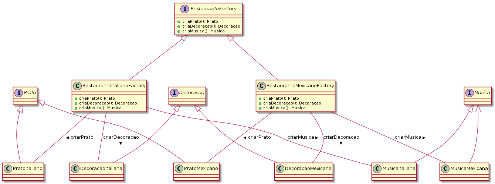

## Também conhecido como
Kit

## Intenção
Fornecer uma interface para criação de famílias de objetos 
relacionados ou dependentes sem especificar suas classes concretas.

## Explicação
Exemplo real

> Para criar um restaurante precisaremos de objetos com temáticas comuns. Um restaurante mexicano precisa de pratos mexicanos, decorações mexicanas e música mexicana. Um restaurante italiano precisa de pratos italianos, decorações italianas e música italiana. Existe uma dependência entre os objetos de um restaurate.

Em palavras simples

> Uma fábrica de fábricas; uma fábrica que agrupa as fábricas individuais, mas relacionadas / dependentes, sem especificar suas classes concretas.

Wikipedia diz

> Este padrão permite a criação de famílias de objetos relacionados ou dependentes por meio de uma única interface e sem que a classe concreta seja especificada.

**Examplo implementado**

Traduzindo o exemplo do restaurante acima. Primeiro de tudo, teremos interfaces e implementações para os objetos do restaurante.

```java
public interface Prato {
  String descricao();
}
public interface Decoracao {
  String descricao();
}
public interface Musica {
  String descricao();
}

// Implementacões para o restaurante italiano ->
public class PratoItaliano implements Prato {
  static final String DESCRICAO = "Este é um prato italiano!";
  @Override
  public String descricao() {
    return DESCRICAO;
  }
}
public class DecoracaoItaliana implements Decoracao {
  static final String DESCRICAO = "Esta é uma decoracao italiana!";
  @Override
  public String descricao() {
    return DESCRICAO;
  }
}
public class MusicaItaliana implements Musica {
  static final String DESCRICAO = "Esta é uma música italiano!";
  @Override
  public String descricao() {
    return DESCRICAO;
  }
}

// Implementação mexicana similar...

```

Então teremos a abstração e a implementação para a factory de restaurante

```java
public interface RestauranteFactory {
  Prato criarPrato();
  Decoracao criarDecoracao();
  Musica criarMusica();
}

public class RestauranteItalianoFactory implements RestauranteFactory {
  public Prato criarPrato() {
    return new PratoItaliano();
  }
  public Decoracao criarDecoracao() {
    return new DecoracaoItaliana();
  }
  public Musica criarMusica() {
    return new MusicaItaliana();
  }
}

public class RestauranteMexicanoFactory implements RestauranteFactory {
  public Prato criarPrato() {
    return new PratoMexicano();
  }
  public Decoracao criarDecoracao() {
    return new DecoracaoMexicana();
  }
  public Musica criarMusica() {
    return new MusicaMexicana();
  }
}
```

Agora temos nossa fábrica _(factory)_ abstrata que nos permite criar famílias de objetos relacionados. Exemplo: RestauranteItalianoFactory cria um Prato italiano, uma Decoracao italiana e uma Musica italiana.

```java
RestauranteFactory factory = new RestauranteItalianoFactory();
Prato prato = factory.criarPrato();
Decoracao decoracao = factory.criarDecoracao();
Musica musica = factory.criarMusica();

prato.descricao();  // Saída: Este é um prato italiano!!
decoracao.descricao(); // Saída: Esta é uma decoracao italiana!!
musica.descricao(); // Saída: Esta é uma música italiana!!
```

Agora, podemos projetar uma fábrica para nossas diferentes fábricas de restaurante. Neste exemplo, criamos o FactoryMaker, responsável por retornar uma instância de RestauranteItalianoFactory ou RestauranteMexicanoFactory.
O cliente pode usar o FactoryMaker para criar a fábrica de concreto desejada que, por sua vez, produzirá objetos concretos diferentes (Prato, Decoracao, Musica).
Neste exemplo, também usamos um enum para parametrizar qual tipo de fábrica de restaurante o cliente solicitará.


```java
public static class FactoryMaker {

  public enum RestauranteType {
    ITALIANO, MEXICANO
  }

  public static RestauranteFactory makeFactory(RestauranteType type) {
    switch (type) {
      case ITALIANO:
        return new RestauranteItalianoFactory();
      case MEXICANO:
        return new RestauranteMexicanoFactory();
      default:
        throw new IllegalArgumentException("Tipo de restaurante não suportado.");
    }
  }
}

public static void main(String[] args) {
  App app = new App();

  LOGGER.info("Restaurante Italiano");
  app.criarRestaurante(FactoryMaker.makeFactory(RestauranteType.ITALIANO));
  LOGGER.info(app.getPrato().descricao());
  LOGGER.info(app.getDecoracao().descricao());
  LOGGER.info(app.getMusica().descricao());

  LOGGER.info("Restaurante Mexicano");
  app.criarRestaurante(FactoryMaker.makeFactory(RestauranteType.MEXICANO));
  // -- uso similar da fábrica de restaurante mexicano
}
```



## Applicabilidade

Use o padrão Abstract Factory quando:
* um sistema deve ser independente de como seus produtos são criados,
compostos ou representados;
* um sistema deve ser configurado como um produto de uma família de
múltiplos produtos;
* uma família de objetos-produto for projetada para ser usada em conjunto, e você necessita garantir esta restrição;
* você quer fornecer uma biblioteca de classes de produtos e quer revelar somente suas interfaces, não suas implementações.

## Casos de uso:	

* Selecionando para chamar a implementação apropriada de FileSystemAcmeService ou DatabaseAcmeService ou NetworkAcmeService em tempo de execução.
* Escrita de caso de teste de unidade se torna muito mais fácil

## Consequências:

O padrão Abstract Factory tem os seguintes benefícios e desvantagens:

1. _Ele isola as classes concretas._ O padrão Abstract Factory ajuda a controlar as classes de objetos criadas por uma aplicação. Uma vez que a fábrica encapsula a responsabilidade e o processo de criar objetos-produto, isola os clientes das classes de implementação. Os clientes manipulam as instâncias através das suas interfaces abstratas. Nomes de classes-produto ficam isolados na
implementação da fábrica concreta; eles não aparecem no código do cliente.

2. _Ele torna fácil a troca de famílias de produtos._ A classe de uma fábrica concreta aparece apenas uma vez numa aplicação – isto é, quando é instanciada. Isso torna fácil mudar a fábrica concreta que uma aplicação usa. Ela pode usar diferentes configurações de produtos simplesmente trocando a fábrica concreta. Uma vez que a fábrica abstrata cria uma família completa de produtos, toda família de produtos muda de uma só vez. No nosso exemplo de restaurante, podemos mudar o restaurante de Italiano para Mexicano simplesmente trocando os correspondentes objetos-fábrica e recriando a interface.

3. _Ela promove a harmonia entre produtos._ Quando objetos-produto numa família são projetados para trabalharem juntos, é importante que uma aplicação use objetos de somente uma família de cada vez. AbstractFactory torna fácil assegurar isso.

4. _É difícil de suportar novos tipos de produtos._ Estender fábricas abstratas para produzir novos tipos de Produtos não é fácil. Isso se deve ao fato de que a interface de AbstractFactory fixa o conjunto de produtos que podem ser criados. Suportar novos tipos de produto exige estender a interface da fábrica, o que envolve mudar a classe AbstractFactory e todas as suas subclasses.

## Tutorial
* [Abstract Factory Pattern Tutorial](https://www.journaldev.com/1418/abstract-factory-design-pattern-in-java) _(em inglês)_
* [Padrão de Projeto: Abstract Factory](https://www.thiengo.com.br/padrao-de-projeto-abstract-factory)
* [Padrão Abstract Factory](https://www.devmedia.com.br/padrao-abstract-factory/23030)

## Exemplos reais

* [javax.xml.parsers.DocumentBuilderFactory](http://docs.oracle.com/javase/8/docs/api/javax/xml/parsers/DocumentBuilderFactory.html)
* [javax.xml.transform.TransformerFactory](http://docs.oracle.com/javase/8/docs/api/javax/xml/transform/TransformerFactory.html#newInstance--)
* [javax.xml.xpath.XPathFactory](http://docs.oracle.com/javase/8/docs/api/javax/xml/xpath/XPathFactory.html#newInstance--)

## Créditos

* [Padrões de Projetos: Soluções Reutilizáveis de Software Orientados a Objetos - GoF](https://www.amazon.com.br/Padr%C3%B5es-Projetos-Solu%C3%A7%C3%B5es-Reutiliz%C3%A1veis-Orientados/dp/8573076100?tag=goog0ef-20&smid=A1ZZFT5FULY4LN&ascsubtag=go_729680143_34002717090_172477348789_pla-386979319859_c_) _(livro)_
* [Design patterns implemented in Java](https://github.com/iluwatar/java-design-patterns/tree/master/abstract-factory) _(Repositório)_