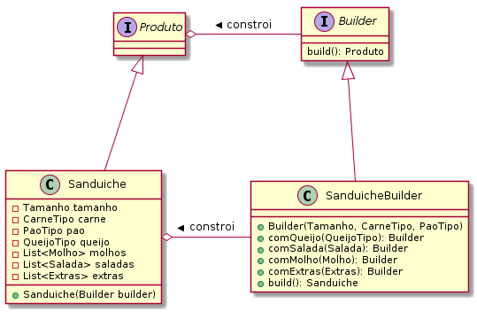

## Intenção
Separar a construção de um objeto complexo da sua representação de modo que o mesmo processo de construção possa criar diferentes representações.

## Explicação
Exemplo real

> Imagine que você está no McDonald's e você pede uma oferta específica, digamos, "McLanche Feliz" e eles entregam a você sem nenhuma pergunta; Este é o exemplo da fábrica simples. Mas há casos em que a lógica de criação pode envolver mais etapas. Por exemplo, você quer uma oferta personalizada do Subway, você tem várias opções de como seu hambúrguer é feito, por exemplo, que pão você quer? que tipos de molhos você gostaria? Que queijo você quer? etc. Nesses casos, o padrão Builder vem para o resgate.

Em palavras simples

> Permite que você crie diferentes formas de um objeto, evitando a poluição do construtor. Útil quando pode haver várias formas de um objeto ou quando há muitas etapas envolvidas na criação de um objeto.

Wikipedia diz

> Builder é um padrão de projeto de software criacional que permite a separação da construção de um objeto complexo da sua representação, de forma que o mesmo processo de construção possa criar diferentes representações.

**Examplo implementado**

Tendo dito isso, deixe-me acrescentar um pouco sobre o que é o **anti-padrão de construtor telescópico**. Em um ponto ou outro, todos nós vimos um construtor como abaixo:

```java
public Sanduiche(Tamanho tamanho, CarneTipo carne, PaoTipo pao, QueijoTipo queijo, Extras extras, Salada salada, Molho molho) { }
```

Como você pode ver, o número de parâmetros do construtor pode rapidamente ficar fora de controle e pode se tornar difícil entender a disposição dos parâmetros. Além disso, essa lista de parâmetros pode continuar crescendo se você quiser adicionar mais opções no futuro. Isso é chamado de **antipadrão construtor telescópico**.

A alternativa sadia é usar o padrão Builder. Primeiro de tudo, temos nosso sanduíche que queremos criar:

```java
public final class Sanduiche {
	
	private final Tamanho tamanho;
    private final CarneTipo carne;
    private final PaoTipo pao;
    private final QueijoTipo queijo;
    private final List<Extras> extras;
    private final List<Salada> salada;
    private final List<Molho> molho;

  private Sanduiche(Builder builder) {
    this.tamanho = builder.tamanho;
    this.carne = builder.carne;
    this.pao = builder.pao;
    this.queijo = builder.queijo;
    this.extras = builder.extras;
    this.salada = builder.salada;
    this.molho = builder.molho;
  }
}
```

E então temos o Builder:

```java
public static class Builder {

	private final Tamanho tamanho;
	private final CarneTipo carne;
	private final PaoTipo pao;
	private QueijoTipo queijo;
	private List<Extras> extras;
	private List<Salada> salada;
	private List<Molho> molho;

	public Builder(Tamanho tamanho, CarneTipo carne, PaoTipo pao) {
		if (tamanho == null || carne == null || pao == null)
			throw new IllegalArgumentException("É necessário definir o tamanho, a carne e o pão!");

		this.tamanho = tamanho;
		this.carne = carne;
		this.pao = pao;
	}

	public Builder comQueijo(QueijoTipo queijo) {
		this.queijo = queijo;
		return this;
	}

	public Builder comExtras(List<Extras> extras) {
		this.extras = extras;
		return this;
	}

	public Builder comSalada(List<Salada> salada) {
		this.salada = salada;
		return this;
	}

	public Builder comMolho(List<Molho> molho) {
		this.molho = molho;
		return this;
	}

	public Sanduiche build() {
		return new Sanduiche(this);
	}
}

```
e poderemos usá-lo da seguinte forma:

```java
Sanduiche sandubaSemSalada = new Sanduiche.Builder(Tamanho.TRINTA_CENTIMETROS, CarneTipo.FRANGO, PaoTipo.QUATRO_QUEIJOS).comQueijo(QueijoTipo.MUSSARELA).build();
```



## Applicabilidade

Use o padrão Builder quando:

* o algoritmo para criação de um objeto complexo deve ser independente das partes que compõem o objeto e de como elas são montadas.
* o processo de construção deve permitir diferentes representações para o objeto que é construído.

## Consequências:

A seguir são apresentadas as conseqüências-chave da utilização do padrão Builder:

1. _Permite variar a representação interna de um produto._ O objeto Builder fornece ao cliente uma interface abstrata para a construção do produto. A interface permite ao construtor ocultar a representação e a estrutura interna do produto. Ela também oculta como o produto é montado. Já que o produto é construído através de uma interface abstrata, tudo o que você tem que fazer para mudar sua representação interna é definir um novo tipo de construtor.

2. _Isola o código para construção e representação._ O padrão Builder melhora modularidade pelo encapsulamento da forma como um objeto complexo é construído e representado. Os clientes nada necessitam saber sobre as classes que definem a estrutura interna do produto; tais classes não aparecem na interface de Builder. Cada ConcreteBuilder contém todo o código para criar e montar um tipo de produto específico. O código é escrito somente uma vez; então, diferentes Directors podem reutilizá-lo para construir variantes de Product com o mesmo conjunto de partes. No exemplo anterior do RTF, nós poderíamos definir o leitor para um formato diferente do RTF, digamos um SGMLReader, e usado os mesmos TextConverters para gerar representações ASCIIText, TeXText, e TexWidget de documentos SGML.

3. _Oferece um controle mais fino sobre o processo de construção._ Ao contrário de padrões de criação que constroem produtos de uma só vez, o Builder constrói o produto passo a passo sob o controle do cliente. Somente quando o produto está terminado o cliente o recupera do construtor. Daí a interface de Builder refletir o processo de construção do produto mais explicitamente do que outros padrões de criação. Isso dá um controle mais fino sobre o processo de construção e, conseqüentemente, da estrutura interna do produto resultante.

## Padrões relacionados

- Abstract Factory é semelhante a Builder no sentido de que também pode construir objetos complexos. A diferença principal é que o padrão Builder focaliza a construção de um objeto complexo passo a passo. A ênfase do Abstract Factory é sobre famílias de objetos-produto (simples ou complexos). O Builder retorna o produto como um passo final, mas no caso do padrão Abstract Factory o produto é retornado imediatamente.

- Um Composite é o que freqüentemente o builder constrói.

## Tutorial

[Design Patterns: aplicando os padrões builder, Singleton e prototype](https://www.devmedia.com.br/design-patterns-aplicando-os-padroes-builder-singleton-e-prototype/31023)
[Mão na massa: Builder](https://brizeno.wordpress.com/category/padroes-de-projeto/builder/)


## Exemplos reais
* [java.lang.StringBuilder](http://docs.oracle.com/javase/8/docs/api/java/lang/StringBuilder.html)
* [java.nio.ByteBuffer](http://docs.oracle.com/javase/8/docs/api/java/nio/ByteBuffer.html#put-byte-) assim como outros Buffers similares como FloatBuffer, IntBuffer e assim por diante.
* [java.lang.StringBuffer](http://docs.oracle.com/javase/8/docs/api/java/lang/StringBuffer.html#append-boolean-)
* Todas as implementações de [java.lang.Appendable](http://docs.oracle.com/javase/8/docs/api/java/lang/Appendable.html)
* [Apache Camel builders](https://github.com/apache/camel/tree/0e195428ee04531be27a0b659005e3aa8d159d23/camel-core/src/main/java/org/apache/camel/builder)

## Créditos

* [Padrões de Projetos: Soluções Reutilizáveis de Software Orientados a Objetos - GoF](https://www.amazon.com.br/Padr%C3%B5es-Projetos-Solu%C3%A7%C3%B5es-Reutiliz%C3%A1veis-Orientados/dp/8573076100?tag=goog0ef-20&smid=A1ZZFT5FULY4LN&ascsubtag=go_729680143_34002717090_172477348789_pla-386979319859_c_) _(livro)_
* [Effective Java (2nd Edition)](http://www.amazon.com/Effective-Java-Edition-Joshua-Bloch/dp/0321356683) _(livro)_
* [Design patterns implemented in Java](https://github.com/iluwatar/java-design-patterns/tree/master/abstract-factory) _(Repositório)_
* [Design patterns for humans](https://github.com/kamranahmedse/design-patterns-for-humans#-builder) _(Repositório)_