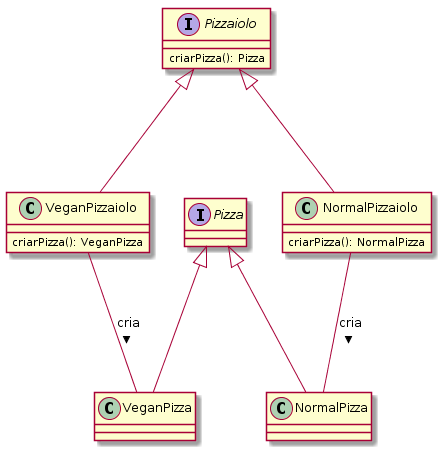

## Também conhecido como
Virtual Constructor

## Intenção
Definir uma interface para criar um objeto, mas deixar as subclasses decidirem que classe instanciar. O Factory Method permite adiar a instanciação para subclasses.

## Explicação
Exemplo real

> No cenário de uma pizzaria que faz pizzas de diversos tipos. A forma com que uma pizza vegana é confeccionada é diferente de uma pizza doce, que difere das pizzas normais. Para isso, um diferente Pizzaiolo é empregado para cada tipo de pizza.

Em palavras simples

> Provém uma forma de delegar a lógica de instanciação para as classes filhas. 

Wikipedia diz

> Permite às classes delegar para subclasses decidirem (a criação de um objeto), isso é feito através da criação de objetos que chamam o método fabrica especificado numa interface e implementado por um classe filha ou implementado numa classe abstrata e opcionalmente sobrescrito por classes derivadas.

**Examplo implementado**

Tendo em mente o exemplo descrito no cenário acima, teremos as interfaces base para a confecção das pizzas:

```java
public interface Pizza {}

public interface Pizzaiolo {
  Pizza criarPizza();
}

// Implementação dos tipos de Pizza
public interface VeganPizza { }

public interface NormalPizza { }

// Implementacões do factory das pizzas, o pizzaiolo
public class VeganPizzaiolo implements Pizzaiolo {
  
  @Override
  public Pizza criarPizza() {
    return new VeganPizza();
  }
}

public class NormalPizzaiolo implements Pizzaiolo {
  
  @Override
  public Pizza criarPizza() {
    return new NormalPizza();
  }
}

```


Agora ao criar uma pizza, podemos escolher qual o Pizzaiolo correto fará a que desejamos:

```java
public class App {
	public static void main(String[] args){
	
	// Para pizzas veganas
	Pizzaiolo pizzaiolo = new VeganPizzaiolo();
	pizzaiolo.criarPizza(); // Retornará um Pizza vegana
	
	// Pizzas normais
	Pizzaiolo pizzaiolo2 = new NormalPizzaiolo();
	pizzaiolo2.criarPizza(); // Retornará um pizza normal
	
	}
}
```



## Applicabilidade

Use o padrão Factory Method quando:

* uma classe não pode antecipar a classe de objetos que deve criam;

* uma classe quer que suas subclasses especifiquem os objetos que criam;

* classes delegam responsabilidade para uma dentre várias subclasses auxiliares, e você quer localizar o conhecimento de qual subclasse auxiliar que é a delegada.

# Padrões relacionados

- **Abstract Factory** é freqüentemente implementado utilizado o padrão Factory Method. O exemplo do módulo **Abstract Factory** ilustra o padrão Factory Method.

- Factory Methods são usualmente chamados dentro de **Template Methods**.

- **Prototypes** não exigem subclassificação de Creator. Contudo, freqüentemente necessitam uma operação Initialize na classe Product. A Creator usa Initialize para iniciar o objeto. O Factory Method não exige uma operação desse tipo.

## Tutorial
* [actory Method Design Pattern](https://sourcemaking.com/design_patterns/factory_method) _(em inglês)_
* [Padrão de Projeto: Factory Method](https://www.thiengo.com.br/padrao-de-projeto-factory-method)
* [Padrão de Projeto Factory Method em Java](https://www.devmedia.com.br/padrao-de-projeto-factory-method-em-java/26348)

## Exemplos reais

* [java.util.Calendar](http://docs.oracle.com/javase/8/docs/api/java/util/Calendar.html#getInstance--)
* [java.util.ResourceBundle](http://docs.oracle.com/javase/8/docs/api/java/util/ResourceBundle.html#getBundle-java.lang.String-)
* [java.text.NumberFormat](http://docs.oracle.com/javase/8/docs/api/java/text/NumberFormat.html#getInstance--)
* [java.nio.charset.Charset](http://docs.oracle.com/javase/8/docs/api/java/nio/charset/Charset.html#forName-java.lang.String-)
* [java.net.URLStreamHandlerFactory](http://docs.oracle.com/javase/8/docs/api/java/net/URLStreamHandlerFactory.html#createURLStreamHandler-java.lang.String-)
* [java.util.EnumSet](https://docs.oracle.com/javase/8/docs/api/java/util/EnumSet.html#of-E-)
* [javax.xml.bind.JAXBContext](https://docs.oracle.com/javase/8/docs/api/javax/xml/bind/JAXBContext.html#createMarshaller--)

## Créditos

* [Padrões de Projetos: Soluções Reutilizáveis de Software Orientados a Objetos - GoF](https://www.amazon.com.br/Padr%C3%B5es-Projetos-Solu%C3%A7%C3%B5es-Reutiliz%C3%A1veis-Orientados/dp/8573076100?tag=goog0ef-20&smid=A1ZZFT5FULY4LN&ascsubtag=go_729680143_34002717090_172477348789_pla-386979319859_c_) _(livro)_
* [Design patterns implemented in Java](https://github.com/iluwatar/java-design-patterns/tree/master/factory-method) _(Repositório)_