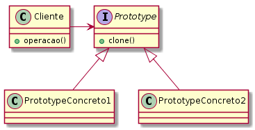

## Intenção
Especificar os tipos de objetos a serem criados usando uma instância-protótipo e criar novos objetos pela cópia desse protótipo.

## Explicação

Exemplo real

> Em uma lanchonete, duas pessoas que fizeram o mesmo pedido. Podemos dizer que o segundo pedido é um clone do primeiro.

Em palavras simples

> Criar um objeto baseado em um objeto existente através de clone.

Wikipedia diz

> Permite a criação de novos objetos a partir de um modelo original ou protótipo que é clonado.

Em suma, ele permite que você crie uma cópia de um objeto existente e modifique-o de acordo com suas necessidades, em vez de se dar ao trabalho de criar um objeto do zero e configurá-lo.

**Examplo implementado**

Em Java, isso pode ser feito facilmente implementando a interface Cloneable e sobrescrevendo o método clone do objeto.

```java

class Pedido implements Cloneable {
	
	private String nomeDoPedido;
	
	Pedido(String nomeDoPedido) {
		this.nomeDoPedido = nomeDoPedido;
	}
	
	@Override
    public Pedido clone() throws CloneNotSupportedException {
        return new Pedido(name);
    }
}

```

E pode ser clonado como abaixo:

```java
Pedido pedido = new Pedido("Pedido 1");

Pedido pedido2 = pedido.clone();
```



## Applicabilidade

Use o padrão Prototype quando um sistema tiver que ser independente de como os seus
produtos são criados, compostos e representados; e

* quando as classes a instanciar forem especificadas em tempo de execução, por exemplo, por carga dinâmica; ou

* para evitar a construção de uma hierarquia de classes de fábricas paralela à hierarquia de classes de produto; ou

* quando as instâncias de uma classe puderem ter uma dentre poucas combinações diferentes de estados. Pode ser mais conveniente instalar um número correspondente de protótipos e cloná-los, ao invés de instanciar a classe manualmente, cada vez com um estado apropriado.

## Consequências:

Prototype tem muitas das mesmas conseqüências que **Abstract Factory** e **Builder** têm: ele oculta as classes de produtos concretas do cliente, desta forma
reduzindo o número de nomes que os clientes necessitam saber. Além disso, esses
padrões permitem a um cliente trabalhar com classes específicas de uma aplicação sem
necessidade de modificação.

Os benefícios adicionais do padrão Prototype estão relacionados abaixo:

1. _Acrescenta e remove produtos em tempo de execução._ Prototype permite incorporar uma nova classe concreta de produto a um sistema, simplesmente registrando uma instância protótipo com o cliente. Isso é um pouco mais flexível do que outros padrões de criação, porque o cliente pode instalar e remover protótipos em tempo de execução.

2. _Especifica novos objetos pela variação de valores._ Sistemas altamente dinâmicos permitem definir novos comportamentos através da composição de objetos – por exemplo, pela especificação de valores para as variáveis de um objeto – e não pela definição de novas classes. Você efetivamente define novos tipos de objetos pela instanciação das classes existentes e registrando as instâncias como protótipos dos objetos-clientes. Um cliente pode exibir um novo comportamento através da delegação de responsabilidades para o protótipo. Esse tipo de projeto permite aos usuários definir novas “classes” sem ter que programar. De fato, clonar um protótipo é semelhante a instanciar uma classe. O padrão Prototype pode reduzir grandemente o número de classes que um sistema necessita.

3. _Especifica novos objetos pela variação da estrutura._ Muitas aplicações constróem objetos com partes e subpartes. Por exemplo, editores para o projeto de circuitos que constroem circuitos a partir de subcircuitos. Por questões de conveniência, tais aplicações freqüentemente permitem instanciar estruturas complexas, definidas pelo usuário, para, por exemplo, usar um subcircuito específico repetidas vezes. O padrão Prototype também suporta isso. Simplesmente adicionamos esse subcircuito como um protótipo à paleta dos elementos de circuitos disponíveis. Contanto que o objeto-circuito composto implemente um clone por replicação (deep copy), circuitos com diferentes estruturas podem ser protótipos.

4. _Reduz o número de subclasses._ O Factory Method freqüentemente produz uma hierarquia de classes Creator paralela à hierarquia de classes do produto. O padrão Prototype permite clonar um protótipo em vez de pedir a um método fábrica para construir um novo objeto. Daí não necessitar-se de nenhuma hierarquia de classes Creator. 

O principal ponto fraco do padrão Prototype é que cada subclasse de Prototype deve implementar a operação Clone, o que pode ser difícil. Por exemplo, acrescentar Clone é difícil quando as classes consideradas já existem. A implementação de Clone pode ser complicada quando uma estrutura interna dessas classes inclui objetos que não suportam operação de cópia ou têm referências circulares.

# Padrões relacionados

- Prototype e **Abstract Factory** são padrões que competem entre si em várias situações. Porém, eles também podem ser usados em conjunto. Um **Abstract Factory** pode armazenar um conjunto de protótipos a partir dos quais podem ser clonados e retornados objetos-produto.

- Projetos que utilizam intensamente os padrões **Composite** e **Decorator** também podem se beneficiar do uso do Prototype.

## Tutorial
* [Prototype Design Pattern](https://sourcemaking.com/design_patterns/prototype) _(em inglês)_
* [Prototype](https://brizeno.wordpress.com/category/padroes-de-projeto/prototype/)

## Exemplos reais

* [java.lang.Object#clone()](http://docs.oracle.com/javase/8/docs/api/java/lang/Object.html#clone%28%29)

## Créditos

* [Padrões de Projetos: Soluções Reutilizáveis de Software Orientados a Objetos - GoF](https://www.amazon.com.br/Padr%C3%B5es-Projetos-Solu%C3%A7%C3%B5es-Reutiliz%C3%A1veis-Orientados/dp/8573076100?tag=goog0ef-20&smid=A1ZZFT5FULY4LN&ascsubtag=go_729680143_34002717090_172477348789_pla-386979319859_c_) _(livro)_
* [Design patterns implemented in Java](https://github.com/iluwatar/java-design-patterns/tree/master/prototype) _(Repositório)_